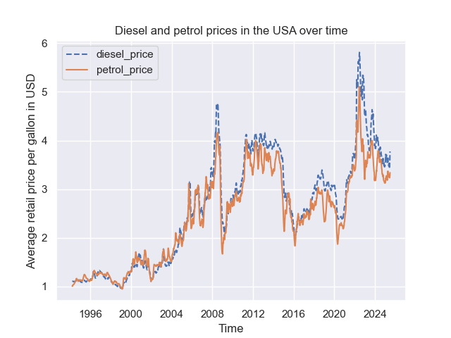

Assorted code from my attempts at [#tidytuesday](https://github.com/rfordatascience/tidytuesday/tree/main)

## 2025-04-29

Pairs of consecutive words (bigrams) which are frequently used (n > 2) in the keywords for talks:

## 2025-05-13

## 2025-07-01

## 2025-12-16

Number of roundabouts by country:

